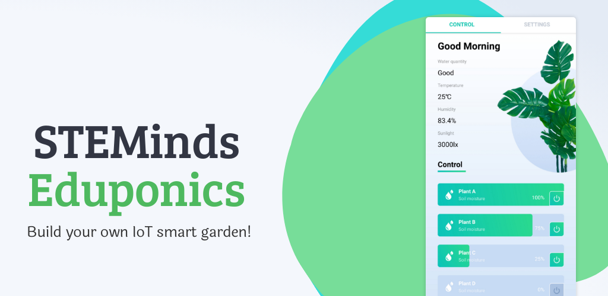

# STEMinds Eduponics Mini smart agriculture kit

The Eduponics Mini is ESP32 based smart agriculture modular kit that enables you to build your own smart garden with ease. 

If you want to learn more about IoT and soil moisture sensors [check our most recent posted article](https://steminds.com/iot-soil-moisture-sensors-smart-garden-irrigation-system/).

In this repository you'll find all the example code necessary to get started with your Eduponics mini ESP32 learning kit.
The MQTT client found in the [Micropython repository](https://github.com/STEMinds/micropython-eduponics) within the eduponics_mqtt folder, it can be used with the Eduponics Mini app which is currently available on the Android play store (search for "Eduponics") and soon will be available on the Apple appstore.

## Eduponics-Micropython

***The Micropython library has been moved to [github.com/STEMinds/micropython-eduponics](https://github.com/STEMinds/micropython-eduponics), if you are looking for the Micropython code, please make sure to visit the correct repository.***

## Eduponics-Arduino

***The Arduino library has been moved to [github.com/STEMinds/micropython-eduponics](https://github.com/STEMinds/platformio-eduponics-mini), if you are looking for the Arduino C code, please make sure to visit the correct repository. Please note, the Arduino Platformio code base is not fully supported, it's still in development process. MicroPython contains all the resources you need to get started.***

## Documentation

The entire documentation is freely available at STEMinds docs: [docs.steminds.com](https://docs.steminds.com/kits/eduponics_mini/introduction)
Feel free to follow along or just go to the bottom to understand how to connect and use the Eduponics mobile app combined with Eduponics mini kit.

## Configuring WiFi for the MQTT client

All the code should work AS IS the only modification required is for the *boot.py* python file to modify the WiFi SSID and Password in order for the ESP32 to connect successfully to your home WiFi. From there, the Eduponics Mini can be controlled from anywhere, even outside of your own network.

Another thing not to forget is to generate a unique UUID either using MicroPython or through online service. in *main.py* where it says:

      UUID = "YOUR_UUID_GENERATED_ID"

Make sure to enter the UUID you've generated and input it into the app.

## Firmwares

Any ESP32 supported framework should work on the Eduponics Mini but we can't promise software support for all the firmwares.
At This moment we only support the MicroPython framework but we might add software examples and drivers for other frameworks in the future.

Here is a list of popular frameworks you could explore using the Eduponics Mini ESP32 board:

* [ESP-IDF Generic Firmware (MicroPython, also work on Arduino IDE)](https://micropython.org/download/esp32/)
* [ESPDuino Firmware](http://www.espruino.com/Download)
* [Lua RTOS](https://github.com/whitecatboard/Lua-RTOS-ESP32)

You might also consider a generic ESP32-IDF3 image with built in ulab (a numpy like library) this firmware can be downloaded from here: [esp32_generic_idf3_ulab](https://gitlab.com/rcolistete/micropython-samples/-/blob/master/ESP32/Firmware/v1.12_with_ulab/ulab_v0.54.0_2020-07-29/Generic_flash-4MB/esp32_idf3_ulab_dp_thread_v1.12-663-gea4670d5a_2020-07-29.bin)

## How to use the IDF3 firmware

The IDF3 ESP32 firmware is generic firmware. it will work both on Arduino IDE and MicroPython.
We install and test the MicroPython Generic IDF3 firmware when we ship the kits, if you want to use the Arduino IDE you can BUT note the following:

Once you use the Arduino IDE you might not be able to use Thonny IDE (MicroPython) again so easily, Thonny IDE might tell you:

      Could not enter REPL. Trying again with 1 second waiting time...

This is due to Arduino IDE removing REPL (The MicroPython interpreter) in order to solve it, go to your Thonny IDE settings under interpreter and press "Open the dialog for installing or upgrading MicroPython" and select the firmware **firmware_name_v1.20.bin** (version or name might be different) which you can download from the links above.

This will install REPL again and you'll be able to use MicroPython without any problem. if you'll use Arduino IDE again, you might need to repeat the process.

## Eduponics Mini Extension board

The Extension board allows to connect extra 4 soil moisture sensors (or any other analog input devices) and extra output devices (digital output devices with 12V support by using relays). The board designed using ADS1115 for ADC support and MCP23017 for GPIO control with some advance functionalities such as interrupt on change and precise analog data reading. If you are using Eduponics v2.0, instead of MCP23017 we replaced it with PCA9535.

Both chips use the I2C protocol which means we can control all the functionalities using only 2 pins (SDA and SCL) it also means it's 100% compatible with Raspberry Pi as it doesn't have a built in ADC.

## License

Some of the code is taken from other repositories, proper credits and license is given at the beginning of each file.
All the example code and files are under MIT License.

Copyright (c) 2020-2023 STEMinds

Permission is hereby granted, free of charge, to any person obtaining a copy
of this software and associated documentation files (the "Software"), to deal
in the Software without restriction, including without limitation the rights
to use, copy, modify, merge, publish, distribute, sublicense, and/or sell
copies of the Software, and to permit persons to whom the Software is
furnished to do so, subject to the following conditions:
The above copyright notice and this permission notice shall be included in all
copies or substantial portions of the Software.

THE SOFTWARE IS PROVIDED "AS IS", WITHOUT WARRANTY OF ANY KIND, EXPRESS OR
IMPLIED, INCLUDING BUT NOT LIMITED TO THE WARRANTIES OF MERCHANTABILITY,
FITNESS FOR A PARTICULAR PURPOSE AND NON-INFRINGEMENT. IN NO EVENT SHALL THE
AUTHORS OR COPYRIGHT HOLDERS BE LIABLE FOR ANY CLAIM, DAMAGES OR OTHER
LIABILITY, WHETHER IN AN ACTION OF CONTRACT, TORT OR OTHERWISE, ARISING FROM,
OUT OF OR IN CONNECTION WITH THE SOFTWARE OR THE USE OR OTHER DEALINGS IN THE
SOFTWARE.
